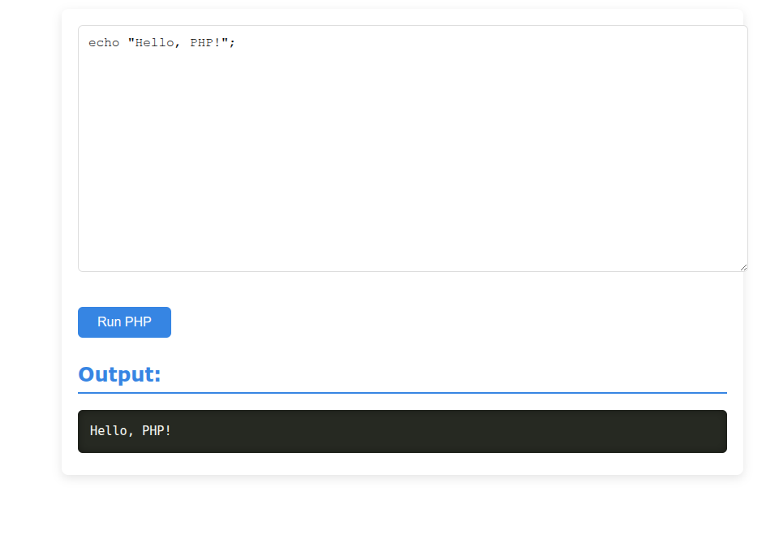

# PHP Snippet Runner

A lightweight web-based PHP sandbox that allows users to write and execute PHP code directly in the browser. Powered by Node.js and the [`@platformatic/php-node`](https://github.com/platformatic/php-node) package.

## ✨ Features

- Run PHP snippets in real-time
- Clean web UI with syntax highlighting
- Syntax highlighting using Prism.js
- Secure, containerized PHP execution (with future sandboxing support)
- Built with Express.js and Platformatic PHP bridge

## 📸 Preview



## 🚀 Getting Started

### 1. Clone the Repository

```bash
git clone https://github.com/your-username/php-snippet-runner.git
cd php-snippet-runner
```

### 2. Install Dependencies

```bash
npm install
```


### 3. Start the Server

```bash
node server.js
```

Visit: [http://localhost:3001](http://localhost:3001)

---

## 📁 Project Structure

```
php-snippet-runner/
├── public/             # Frontend files (HTML, CSS, JS)
│   ├── index.html
│   └── style.css
├── php/                # PHP docroot folder
│   └── index.php
├── server.js           # Node.js + Express server
├── package.json
└── README.md
```

---

## 🛡️ Warning

This is **not safe** for public deployment as-is. The use of `eval()` in PHP is dangerous and can lead to code injection vulnerabilities. For secure environments, consider:

- Disabling risky PHP functions
- Running inside Docker containers
- Adding rate limiting or auth
- Validating or sandboxing input

---

## 🧪 Technologies Used

- Node.js
- Express.js
- [@platformatic/php-node](https://github.com/platformatic/php-node)
- PHP 8+

---

## 📄 License

MIT — feel free to use, learn, and modify.

---

## 💡 Future Improvements

- Add Dockerized sandbox for safer execution
- Support CLI-based PHP execution via child processes
- Live auto-run mode (like JSFiddle)
- Save snippets in browser/localStorage

---

## 🙌 Acknowledgments

Thanks to [Platformatic](https://github.com/platformatic) for the `php-node` bridge and the community for continued support.